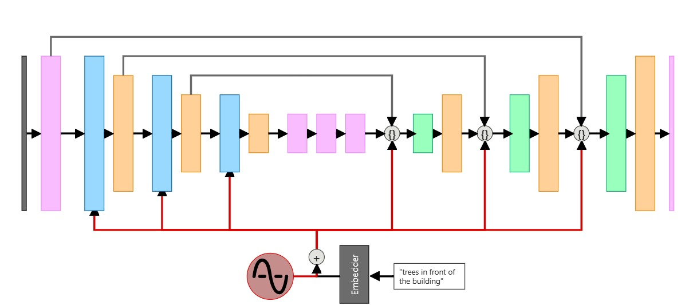

# Latent Diffusion Model for Image Generation

An implementation of a **Latent Diffusion Model** designed for image generation. This repository contains a PyTorch-based model that combines ResNet blocks, self-attention mechanisms, and downsampling/upsampling operations to learn latent representations for generating high-quality images.

## What is a Latent Diffusion Model?

A Latent Diffusion Model (LDM) is a generative model that learns to generate data by gradually denoising it in a latent (lower-dimensional) space. Unlike standard diffusion models that operate directly in pixel space, LDMs work in a compressed latent space for improved computational efficiency and generation quality. The process involves:

1. **Forward Process**: Gradually adding noise to the input data.
2. **Reverse Process**: Learning to reverse the noise addition through a neural network.
3. **Latent Space**: Performing these operations in a compressed latent space to reduce computational complexity.

  

### Key Components
- **ResNet Blocks**: Capture local spatial features through convolutional layers.
- **Self-Attention Blocks**: Model long-range dependencies in the data.
- **Downsampling/Upsampling**: Compress and expand spatial resolution while preserving features.
- **Latent Conditioning**: Integrates latent embeddings to guide the generation process.

---

## Mathematical Intuition

Diffusion models minimize the difference between predicted and actual noise at each denoising timestep. The loss function for a latent diffusion model can be simplified as:

**Loss = 𝔼ₜ[||ε - εₜ(xₜ, t)||²]**

Where:
- `ε` is the actual noise added to the input `x` at timestep `t`.
- `εₜ` is the noise predicted by the model.

The model learns to iteratively denoise the input by predicting the noise component.

---

## Repository Overview

### Code Components

#### 1. **Core Modules**
- `model.py`: Main Latent Diffusion Model architecture.
- `ResNetBlock.py`: Residual blocks with convolutional layers and group normalization.
- `SelfAttentionBlock.py`: Multi-head self-attention with layer normalization.
- `DownSample.py`: Downsampling operation with latent conditioning.
- `UpSample.py`: upsampling operation with latent conditioning.

#### 2. **Key Features**
- Latent space conditioning at multiple resolutions
- Skip connections for preserving spatial features
- Multi-head attention for global context modeling

### Architecture Details

#### Forward Pass Flow
1. **Initial Processing**: Input image passes through a ResNet block.
2. **Downsampling**: Three downsampling stages reduce spatial resolution while increasing channel depth.
3. **Bottleneck**: Self-attention blocks process features at the lowest resolution.
4. **Upsampling**: Three upsampling stages reconstruct the image using residual connections.
5. **Final Convolution**: Maps features back to original input channels.

---

## Installation

Install required dependencies:
```bash
pip install torch torchvision
```

---

## Usage

### Training
1. Prepare dataset directory structure:
   ```
   dataset/
   ├── train/
   └── val/
   ```

### Example Code
```python
import torch
from model import LatentDiffusionModel

# Initialize model
model = LatentDiffusionModel(
    input_channels=3,
    latent_dim=512,
    image_size=(64, 64),
    num_heads=4
)

# Example input
x = torch.randn(8, 3, 64, 64)  # Batch of 8 RGB images
latent = torch.randn(8, 512)   # Random latent vectors

# Forward pass
output = model(x, latent)
print(f"Output shape: {output.shape}")  # (8, 3, 64, 64)
```

---

## Key Features
- ✅ Efficient latent space operations
- ✅ Multi-resolution self-attention
- ✅ Residual skip connections
- ✅ Flexible latent conditioning
---

## Future Improvements
- [ ] Implement time-step conditioning
- [ ] Add classifier-free guidance (cfg)
- [ ] Experiment with VAE-based latent spaces
- [ ] Add mixed-precision training
---

## References
1. [Denoising Diffusion Probabilistic Models (2020)](https://arxiv.org/abs/2006.11239)
2. [High-Resolution Image Synthesis with Latent Diffusion Models (2021)](https://arxiv.org/abs/2112.10752)
3. [Attention Is All You Need (2017)](https://arxiv.org/abs/1706.03762)
